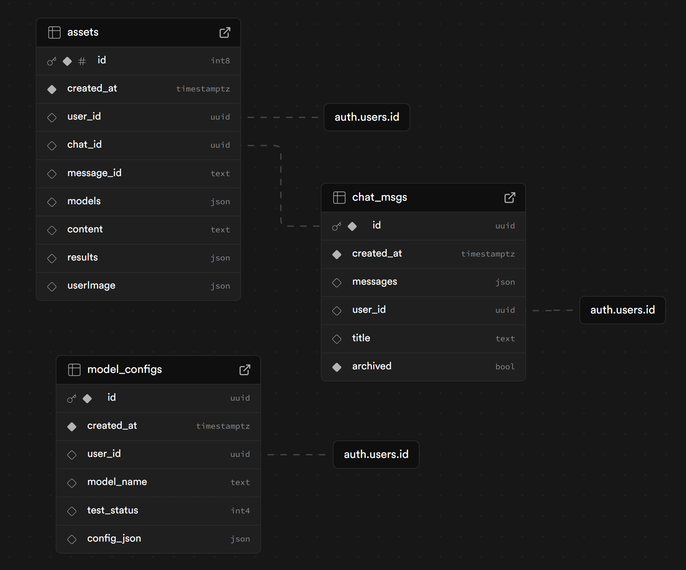
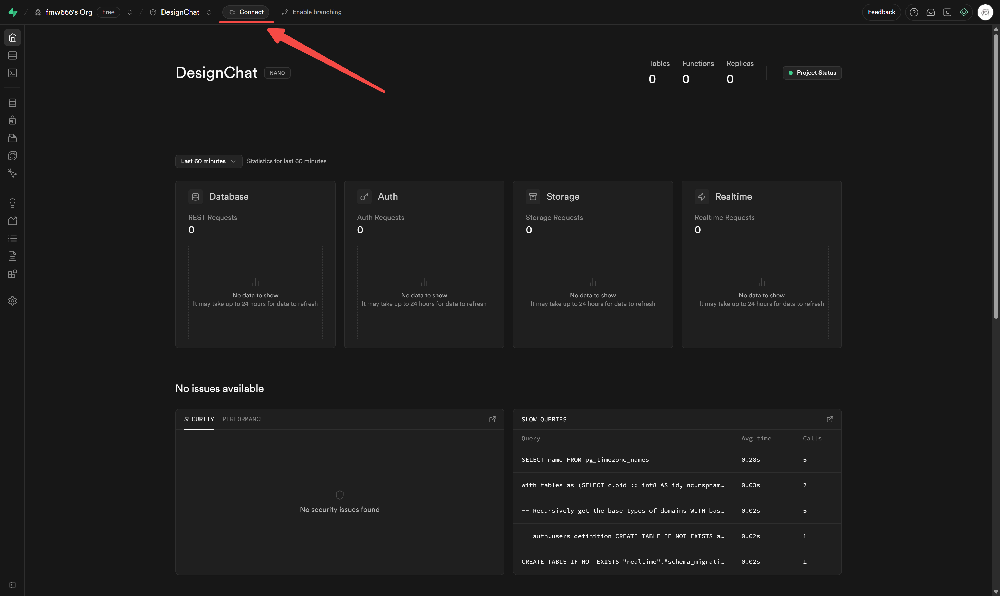
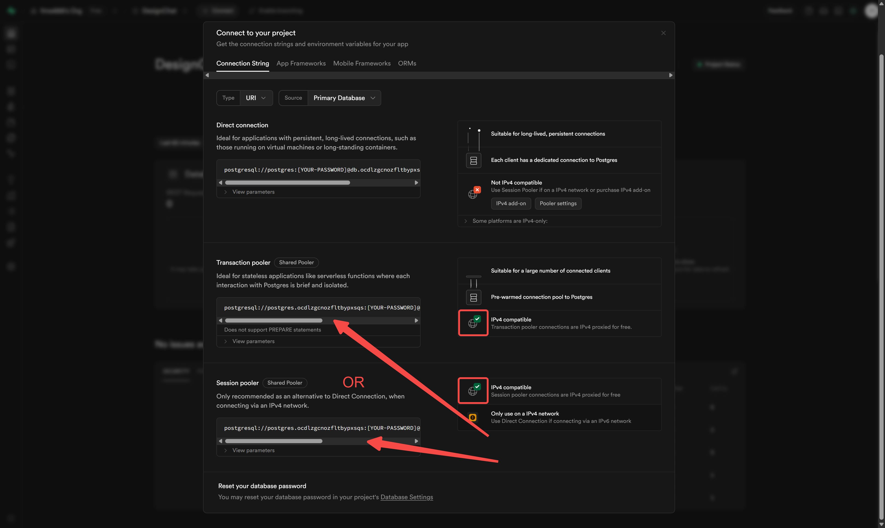

# Supabase Database

## 架构图



## 环境变量说明

- `VITE_SUPABASE_POSTGRES_URL`：Supabase 数据库连接字符串。
  - 获取方式：
    1. 登录 Supabase 控制台，进入你的项目。
    2. 依次点击 **Settings > Database**。
    3. 滚动到 **Connection string**，选择 **URI** 格式，复制连接字符串。
    4. 替换 `[YOUR-PASSWORD]` 为你的数据库密码。
    
<div align="center"></div>

<div align="center"></div>

## 初始化

### 通过脚本自动化

推荐使用自动化脚本快速创建数据库表结构。

#### 依赖环境变量

- `VITE_SUPABASE_POSTGRES_URL`（见上）

#### 操作步骤

1. 如果本地有 Node.js 环境，可以通过内置脚本创建数据库表：
   ```bash
   npm run init:tables
   ```
2. （推荐）如果本地没有 Node.js 环境，可以通过 Docker 运行：
   ```bash
   docker run --rm -v %cd%:/app -w /app node:20 npm run init:tables
   ```

#### 脚本作用
- 自动创建 chat_msgs、assets、model_configs 等核心表。
- 自动应用基础表结构和索引。

#### 常见问题
- **环境变量未配置**：请确保 `.env` 文件中已正确填写 `VITE_SUPABASE_POSTGRES_URL`。
- **连接失败**：请检查数据库连接字符串和网络。
- **表已存在**：脚本会自动跳过已存在的表。


### 手动配置

如需手动创建数据库表，可在 Supabase Dashboard 的 SQL Editor 执行 SQL 脚本。

1. 打开 Supabase 控制台，进入你的项目。
2. 进入 **SQL Editor**。
3. 打开本目录下的 `assets_table.sql`、`chat_msgs_table.sql`、`model_configs_table.sql`，依次粘贴并运行。

---

## 常见问题 FAQ

- **Q: 脚本执行报错"missing required environment variables"？**
  - A: 请检查 `.env` 文件是否存在且变量名拼写正确。
- **Q: 数据库连接失败？**
  - A: 检查连接字符串、数据库密码和网络。
- **Q: 表结构能否自定义？**
  - A: 可以，建议先 fork 脚本并修改 SQL 文件后再运行。

如有更多问题请查阅主项目文档或提交 issue。
